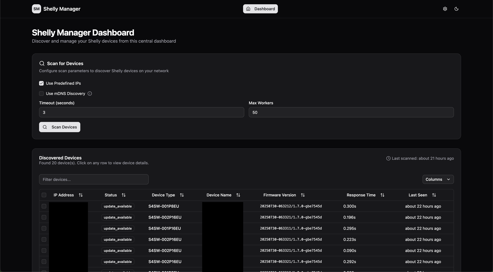
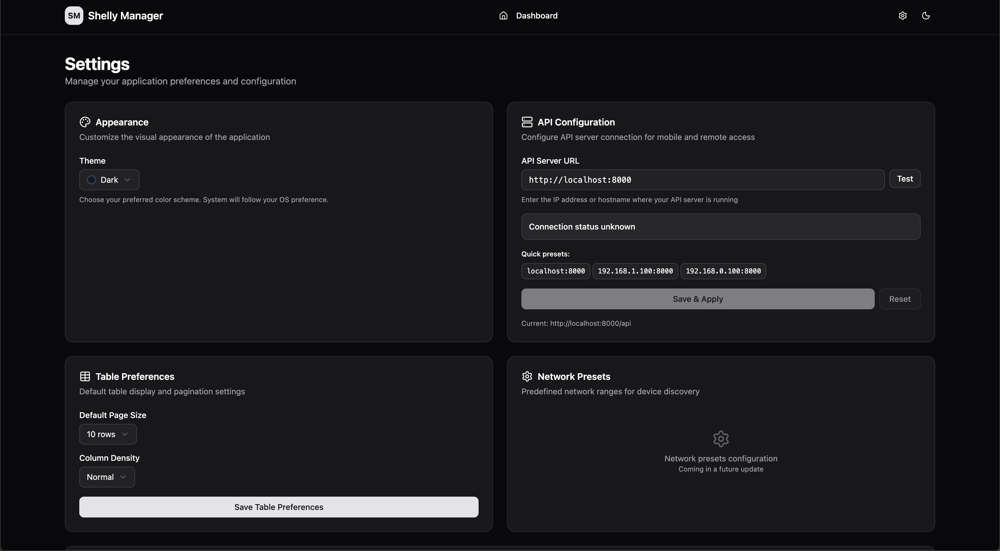
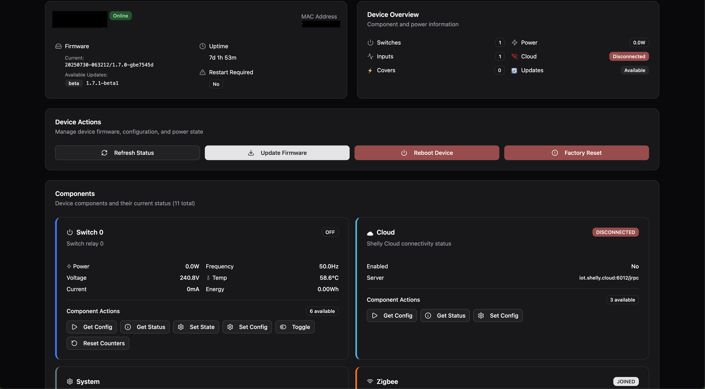
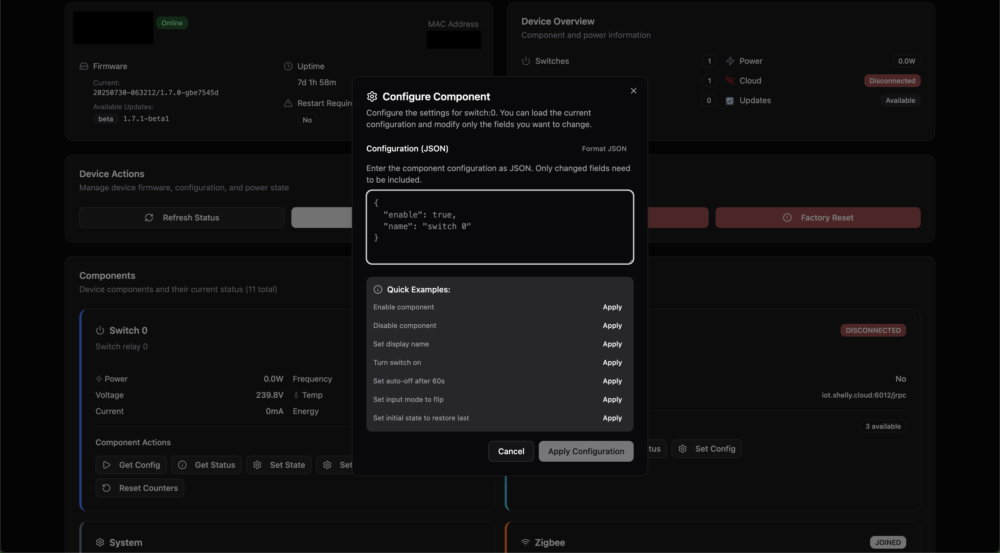
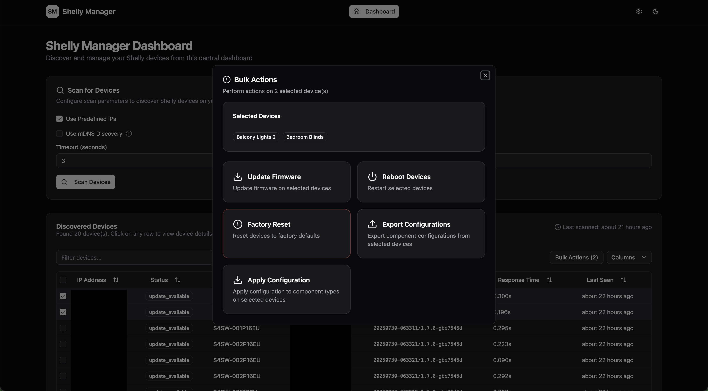
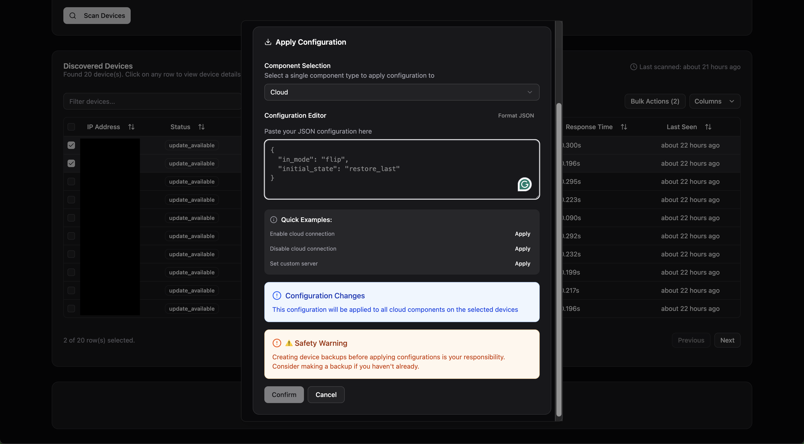

# Shelly Manager

Local management for Shelly IoT devices without cloud connectivity.

[](https://opensource.org/licenses/MIT)
[](https://github.com/jfmlima/shelly-manager/releases)
[](https://github.com/jfmlima/shelly-manager/actions/workflows/api-ci.yml)
[](https://github.com/jfmlima/shelly-manager/actions/workflows/cli-ci.yml)
[](https://github.com/jfmlima/shelly-manager/actions/workflows/web-ci.yml)

Manage Shelly devices on your local network without connecting them to the Shelly Cloud. Scan for devices, update firmware, manage configurations, and monitor status - all locally.

## Features

- Device discovery using mDNS and Network Scanning
- Firmware update management (stable/beta channels)
- Device configuration changes
- Bulk operations across multiple devices
- Status monitoring
- Component action discovery and execution
- Dynamic device capability detection
- Component-specific controls (switches, covers, lights, etc.)

Available as:

- Web interface
- Command line tool
- REST API

## Roadmap

- [ ] **Ensure RED compatibility** - Ensure compliance with [EU RED requirements](https://kb.shelly.cloud/knowledge-base/kbuca-what-you-need-to-know-shelly-and-eu-red) for Shelly devices
- [ ] **Bulk action scheduling** - Schedule bulk operations to run at specific times or intervals

## Screenshots

<table>
  <tr>
    <td width="50%">
      <h3>Dashboard Overview</h3>
      
      <em>Device discovery and management with real-time status monitoring</em>
    </td>
    <td width="50%">
      <h3>Settings & Configuration</h3>
      
      <em>API configuration for mobile access and application preferences</em>
    </td>
  </tr>
  <tr>
    <td width="50%">
      <h3>Device Management</h3>
      
      <em>Individual device control with component actions and status</em>
    </td>
      <td width="50%">
      <h3>Device Action</h3>
      
      <em>Component actions and configurations</em>
    </td>
  </tr>
  <tr>
    <td width="50%">
      <h3>Bulk Operations</h3>
      
      <em>Perform operations on multiple devices simultaneously</em>
    </td>
    <td width="50%">
      <h3>Bulk Configuration Apply</h3>
      
      <em>Apply configurations in bulk to multipled evices</em>
    </td>
  </tr>
</table>

## Quick Start

### Docker

> ℹ️ **mDNS Discovery in Docker**
> requires host networking so the container can listen for multicast traffic.
> Add `network_mode: "host"` to the API container (and run on a Linux host) if you
> want to discover via mDNS while running in Docker. Without host networking,
> only the IP range scan will work.

**Web UI + API Stack**:

```yaml
services:
  shelly-manager-api:
    image: ghcr.io/jfmlima/shelly-manager-api:latest
    #network_mode: "host" # optional, but if you mDNS please uncomment it
    ports:
      - "8000:8000"
    environment:
      - HOST=0.0.0.0
      - PORT=8000

  shelly-manager-web:
    image: ghcr.io/jfmlima/shelly-manager-web:latest
    ports:
      - "8080:8080"
    environment:
      - VITE_BASE_API_URL=http://localhost:8000
    depends_on:
      - shelly-manager-api
```

**With Traefik**:

```yaml
services:
  shelly-manager-api:
    container_name: shelly-manager-api
    image: ghcr.io/jfmlima/shelly-manager-api:latest
    environment:
      - HOST=0.0.0.0
      - PORT=8000
    labels:
      - "traefik.enable=true"
      - "traefik.http.routers.shelly-manager-api.rule=Host(`shelly-manager-api.your.domain`)"
      - "traefik.http.routers.shelly-manager-api.service=shelly-manager-api"
      - "traefik.http.routers.shelly-manager-api.entrypoints=web"
      - "traefik.http.services.shelly-manager-api.loadbalancer.server.port=8000"

  shelly-manager-web:
    container_name: shelly-manager-web
    image: ghcr.io/jfmlima/shelly-manager-web:latest
    environment:
      - VITE_BASE_API_URL=http://shelly-manager-api.your.domain
    depends_on:
      - shelly-manager-api
    labels:
      - "traefik.enable=true"
      - "traefik.http.routers.shelly-manager-web.rule=Host(`shelly-manager.your.domain`)"
      - "traefik.http.routers.shelly-manager-web.service=shelly-manager-web"
      - "traefik.http.routers.shelly-manager-web.entrypoints=web"
      - "traefik.http.services.shelly-manager-web.loadbalancer.server.port=8080"
```

**Home Assistant Add-on**

You can install Shelly Manager as a Home Assistant add-on for seamless integration with your Home Assistant instance:

[](https://my.home-assistant.io/redirect/supervisor_add_addon_repository/?repository_url=https%3A%2F%2Fgithub.com%2Fjfmlima%2Fhome-assistant-addons)

Or manually:

1. **Add the repository** to your Home Assistant:

   ```
   https://github.com/jfmlima/home-assistant-addons
   ```

2. **Navigate** to Settings → Add-ons → Add-on Store in your Home Assistant
3. **Click** the three dots menu (⋮) and select "Repositories"
4. **Add** the repository URL above
5. **Install** the Shelly Manager add-on from the available add-ons list

The add-on provides the same functionality as the Docker deployment but is fully integrated with your Home Assistant environment.

**CLI Only**:

```bash
# Interactive device scanning
docker run --rm -it \
  ghcr.io/jfmlima/shelly-manager-cli:latest \
  scan --target 192.168.1.0/24

# Check device status
docker run --rm -it \
  ghcr.io/jfmlima/shelly-manager-cli:latest \
  device status 192.168.1.100

# Bulk firmware updates
docker run --rm -it \
  ghcr.io/jfmlima/shelly-manager-cli:latest \
  bulk update --target 192.168.1.0/24
```

**API Only**:

```bash
docker run -p 8000:8000 \
  ghcr.io/jfmlima/shelly-manager-api:latest
```

### Configuration

Shelly Manager is zero-configuration by default. All scan and management parameters are provided at runtime via the Web UI, CLI flags, API parameters or ENV variables. This ensures flexibility and removes the need for managing static configuration files.

For persistent storage of discovered devices in the Web UI, the application leverages browser localStorage. For API-based integrations, the client is responsible for maintaining device lists.

## Architecture

```
├── packages/
│   ├── core/              # 🏛️ Business Logic & Domain Models
│   ├── api/               # 🌐 HTTP REST API (Litestar)
│   ├── cli/               # 💻 Command Line Interface (Click)
│   └── web/               # 🖥️ Modern Web UI (React + TypeScript)
└── docker-compose.yml     # Development environment
```

### Package Overview

| Package                       | Purpose                                             | Documentation                          |
| ----------------------------- | --------------------------------------------------- | -------------------------------------- |
| **🏛️ [Core](packages/core/)** | Pure business logic, domain models, and use cases   | [Core README](packages/core/README.md) |
| **🌐 [API](packages/api/)**   | HTTP REST API for web applications and integrations | [API README](packages/api/README.md)   |
| **💻 [CLI](packages/cli/)**   | Modern command-line interface with rich output      | [CLI README](packages/cli/README.md)   |
| **🖥️ [Web](packages/web/)**   | Responsive web UI for device management             | [Web README](packages/web/README.md)   |

## API Overview

The REST API provides complete device management capabilities:

```bash
# Health and status
GET /api/health                    # Service health check
GET /api/devices/scan              # Discover devices on network
GET /api/devices/{ip}/status       # Get device status

# Device operations
POST /api/devices/{ip}/update      # Update device firmware
POST /api/devices/{ip}/reboot      # Reboot device
POST /api/devices/bulk/update      # Bulk firmware updates

# Component Actions
GET /api/devices/{ip}/components/actions           # Discover available actions
POST /api/devices/{ip}/components/{id}/action      # Execute component action
```

**API Documentation**: Start the API server and visit `http://localhost:8000/docs` for interactive OpenAPI documentation

## CLI Overview

The CLI provides powerful automation capabilities:

```bash
# Device discovery
shelly-manager scan --target 192.168.1.0/24
shelly-manager scan --use-mdns

# Device operations
shelly-manager device status 192.168.1.100
shelly-manager device reboot 192.168.1.100
shelly-manager update check --all

# Bulk operations
shelly-manager bulk reboot --target 192.168.1.100-110
shelly-manager bulk update --target 10.0.0.0/24
```

**CLI Documentation**: See [CLI README](packages/cli/README.md) for complete command reference.

## Web UI Overview

The web interface provides an intuitive management experience:

- **Device Discovery**: Network scanning with visual results
- **Bulk Operations**: Select multiple devices for batch operations
- **Real-time Status**: Live device status monitoring
- **Configuration Management**: Easy device configuration editing
- **Dark Mode**: System-aware theme switching

**Web Documentation**: See [Web README](packages/web/README.md) for setup and features.

## Requirements

- **Docker** (recommended) or **Python 3.11+**
- **Network access** to Shelly devices on your local network
- **Optional**: Device credentials for authenticated devices

## Security & Credentials

Shelly Manager supports password-protected Shelly Gen2 devices (HTTP Digest Auth). To enable this feature, you must provide an encryption key.

### 1. Generate an Encryption Key

The application requires a valid Fernet key in the `SHELLY_SECRET_KEY` environment variable.

```bash
# Generate a key using Python
python -c "from cryptography.fernet import Fernet; print(Fernet.generate_key().decode())"
```

### 2. Set the Environment Variable

**Linux / macOS**
```bash
export SHELLY_SECRET_KEY="your-generated-key"
```

**Docker**
```bash
docker run -e SHELLY_SECRET_KEY="your-generated-key" ...
```

**docker-compose.yml**
```yaml
environment:
  - SHELLY_SECRET_KEY=your-generated-key
```

### 3. Manage Credentials

Use the CLI to manage device credentials. Data is stored encrypted locally.

```bash
# Set credentials for a specific device
shelly-manager credentials set AABBCCDDEEFF mypassword --username admin

# Set a global fallback password (used if device-specific not found)
shelly-manager credentials set-global myfallbackpass

# List stored credentials (safe, no passwords shown)
shelly-manager credentials list

# Delete credentials
shelly-manager credentials delete AABBCCDDEEFF
```

## Development

For local development and contributing to Shelly Manager:

```bash
# Clone and setup development environment
git clone https://github.com/jfmlima/shelly-manager.git
cd shelly-manager

# Start development stack
docker-compose up -d

# Or install locally with uv
uv sync --extra dev
```

**Development Guide**: See [DEVELOPMENT.md](DEVELOPMENT.md) for detailed setup instructions, testing, and contribution guidelines.

## 🤝 Contributing

We welcome contributions! Here's how to get started:

1. **Fork** the repository
2. **Clone** your fork locally
3. **Create** a feature branch (`git checkout -b feature/amazing-feature`)
4. **Make** your changes following our [development guidelines](DEVELOPMENT.md)
5. **Add** tests for new functionality
6. **Submit** a pull request

### Development Principles

- **Clean Architecture**: Keep domain logic in the core package
- **Type Safety**: Use comprehensive type hints throughout
- **Testing**: Write tests for all new functionality
- **Documentation**: Update relevant documentation for changes

### Getting Help

- 📖 **Documentation**: Check package-specific READMEs
- 🐛 **Bug Reports**: Open an issue with reproduction steps
- 💡 **Feature Requests**: Describe your use case in an issue
- 💬 **Questions**: Start a discussion for general questions

## License

MIT License - see [LICENSE](LICENSE) file.

## Disclaimer

**USE AT YOUR OWN RISK**: This software is provided "as is" without warranty of any kind. The developers of Shelly Manager are not responsible for any damage, malfunction, or loss of data that may occur to your Shelly devices, network infrastructure, or any other equipment as a result of using this software.

Understand that firmware updates and device modifications carry inherent risks.

By using this software, you acknowledge that you do so at your own risk and that the developers disclaim all liability for any damages or losses that may result from its use.
